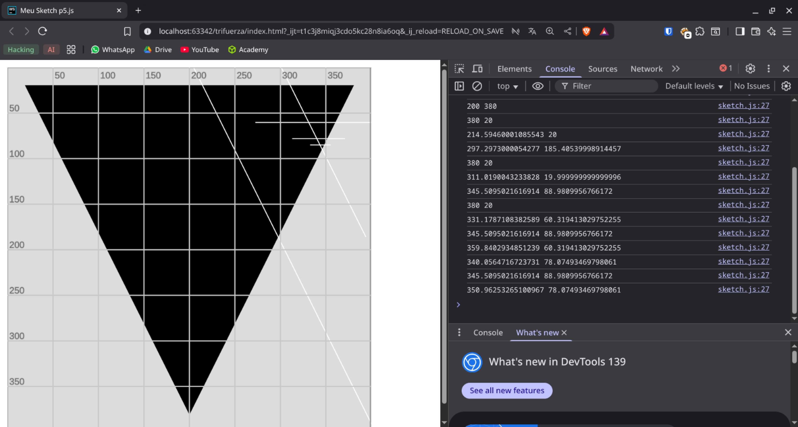

# Infinite Triangle Visualization

A small project created to learn **JavaScript** and the **p5.js** library.  
The project visualizes an infinite triangle pattern and explores vector operations in 2D space.

## Motivation

I wanted to get hands-on experience with:

- Drawing shapes and working with a canvas in p5.js
- Generating random points inside a triangle
- Performing vector calculations and finding line intersections
- Animating geometric patterns step by step

## How It Works

- A triangle is initialized on the canvas.
- A random point is generated inside the triangle.
- A random vertex is selected, and the triangle is modified using vector operations and line intersections.
- The process repeats, creating an evolving triangular pattern.

## Challenges Faced

- Operating with 2D vectors and calculating intersections
- Managing triangle vertices dynamically
- Understanding p5.js drawing and coordinate systems

## Usage

1. Open `index.html` (or your p5.js sketch) in a browser.
2. Watch the triangle pattern evolve over a few iterations.

